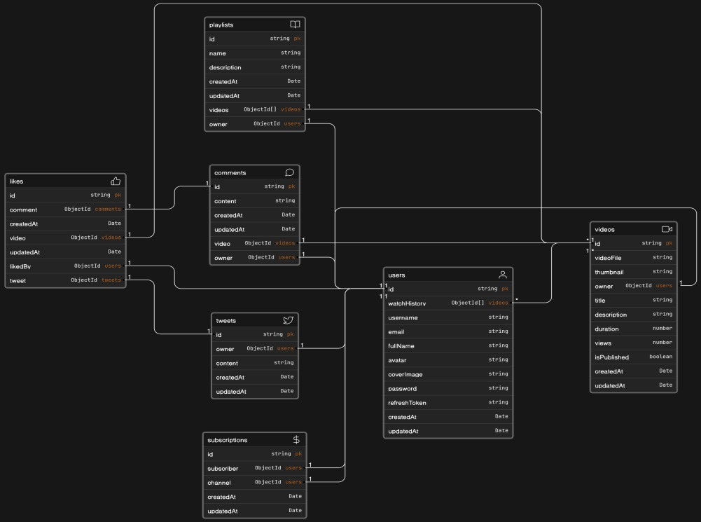

# YouTube Backend Clone with Express.js

This project is a backend clone of YouTube built with Express.js, MongoDB, JWT authentication, and Cloudinary for image and video storage.

## Model Diagram

For a visual representation of the project's models and relationships, refer to the [Model Diagram](https://app.eraser.io/workspace/aNkmxQZDrDEFAKYwFwFS?origin=share&elements=NMQ29crSN11J27dbJELLEA) (clickable link).

## Overview

The project aims to replicate core functionalities of YouTube's backend, including user authentication, profile management, and other key features.

## Installation

1. Clone the repository: `git clone [repository_url]`
2. Install dependencies: `npm install`
3. Set up MongoDB and configure the connection in `.env` file.
4. Set up Cloudinary account and configure cloudinary credentials in `.env` file.
5. Run the application: `npm start`

## Features

### User Authentication:

- **Register User**

  - Endpoint: `POST /api/auth/register`
  - Body: `{ username, email, password, avatar, coverImage }`

- **Login User**
  - Endpoint: `POST /api/auth/login`
  - Body: `{ email, password }`

### Secured Routes:

- **Logout User**

  - Endpoint: `POST /api/auth/logout`

- **Refresh Access Token**

  - Endpoint: `POST /api/auth/refresh-token`

- **Change Password**

  - Endpoint: `POST /api/auth/change-password`
  - Body: `{ newPassword }`

- **Get Current User**

  - Endpoint: `GET /api/auth/current-user`

- **Update Account Details**
  - Endpoint: `PATCH /api/auth/update-account`
  - Body: `{ updatedFields }`

### User Profile:

- **Update User Avatar**

  - Endpoint: `PATCH /api/auth/avatar`
  - Body: `form-data { avatar }`

- **Update User Cover Image**

  - Endpoint: `PATCH /api/auth/cover-image`
  - Body: `form-data { coverImage }`

- **Get User Channel Profile**

  - Endpoint: `GET /api/auth/channel/:username`

- **Get Watch History**
  - Endpoint: `GET /api/auth/watchHistory`

## Middlewares

- **Multer Middleware:** Used for image and video uploads.
- **AuthMiddleware:** JWT authentication middleware.
- **Cloudinary Integration:** Used for storing images and videos.

## Technologies Used

- Express.js
- MongoDB
- JWT (JSON Web Tokens)
- Multer
- Cloudinary

## Learning Outcomes

- Enhanced understanding of Express.js, MongoDB, and JWT for authentication.
- Practical experience in integrating Cloudinary for media storage.
- Strengthened backend development skills through building RESTful APIs.

## Future Enhancements

- Implement additional video-related functionalities.
- Enhance security measures and error handling.
- Improve API documentation and testing procedures.

## Acknowledgment

This project is a result of continuous learning and self-paced practice, aiming to improve my proficiency in backend development.
